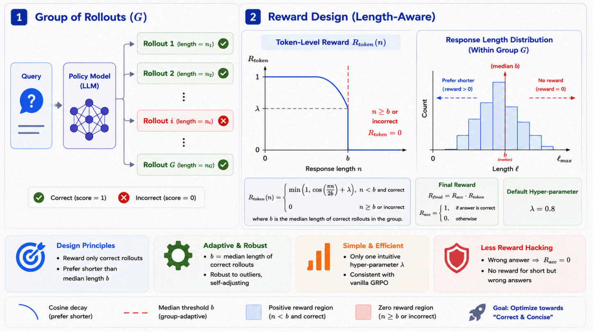

<div align="center">

# HMPO: Hybrid Median-length Policy Optimization for Chain-of-Thought Compression

[](https://arxiv.org/pdf/2606.01934)  [](https://github.com/volcengine/verl)

</div>

<div align="center">
  <p>
    <a href="#-overview" style="text-decoration: none; font-weight: bold;">📖 Overview</a> •
    <a href="#-status" style="text-decoration: none; font-weight: bold;">🚧 Status</a> •
    <a href="#-contact" style="text-decoration: none; font-weight: bold;">📨 Contact</a> •
    <a href="#-citation" style="text-decoration: none; font-weight: bold;">🎈 Citation</a>
  </p>
</div>

---

## 📖 Overview

<div align="center">
  
</div>

**Overview of HMPO.** *Left:* For each query, the policy samples a group of rollouts (G).
*Right:* Instead of relying on a static threshold, HMPO dynamically derives an adaptive
budget `b` from the median length of only the **correct** rollouts to construct a smooth
cosine-decay token reward. *Bottom:* The final reward is combined **multiplicatively** to
enforce a strict "correctness-first, length-second" objective, mathematically preventing
reward hacking (i.e., short but incorrect answers strictly receive zero reward).

HMPO is implemented as a custom reward manager on top of
[verl](https://github.com/volcengine/verl) (v0.7.1), using the `experimental/reward_loop`
architecture. Within each prompt group, HMPO computes the median length of the correct
rollouts as the adaptive budget `b`, then applies a cosine length reward that is combined
multiplicatively with the accuracy reward.

---

## 🚧 Status

The full training code, scripts, and datasets are being prepared for release and will be
open-sourced here soon. Please stay tuned — ⭐ star / watch this repository to get notified.

---

## 📨 Contact

For questions about the paper, please contact the corresponding authors:

- `zhengminghui1@lixiang.com`
- `chenhongxu1@lixiang.com`
- `renhuimin@lixiang.com`

---

## 🎈 Citation

If you find HMPO useful in your research, please consider citing:

```bibtex
@article{zheng2026hmpo,
  title={HMPO: Hybrid Median-length Policy Optimization for Chain-of-Thought Compression},
  author={Zheng, Minghui and Chen, Hongxu and Ren, Huimin and Xin, Hongsheng and Qu, Xiaoyang and Wang, Ze and Yang, Shuling and Peng, Ziyu and Zhang, Kaike and Zhou, Pan and others},
  journal={arXiv preprint arXiv:2606.01934},
  year={2026}
}
```
